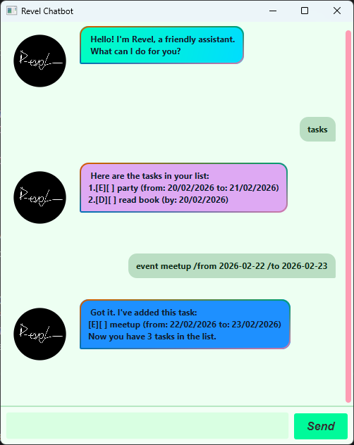

`# Revel User Guide



Revel is a desktop chatbot task manager for users who prefer typing over clicking.


## Quick Start

1. Download the latest `revel.jar`.
2. Ensure Java 17+ is installed.
3. Run:
    - `java -jar revel.jar`
4. Type commands in the input field.

## Command Summary

- `hello` : show welcome message
- `help` : show available commands and aliases
- `list` : list all tasks
- `todo <description>` : add a todo
- `deadline <description> /by <date/time>` : add a deadline
- `event <description> /from <start> /to <end>` : add an event
- `mark <number>` : mark a task as done
- `unmark <number>` : mark a task as not done
- `delete <number>` : delete a task
- `find <keyword>` : find tasks by keyword
- `alias add <alias> <command>` : add custom alias
- `alias remove <alias>` : remove custom alias
- `alias list` : list custom aliases
- `bye` : exit app

## Features

### Viewing Help

Format: `help`

Shows all supported commands and aliases.
```
Available Commands:...
```

### Listing Tasks

Format: `list`

Shows all tasks in your list.

```
Here are the tasks in your list:...
```

### Adding a Todo

Format: `todo <description>`

Example: `todo read chapter 3`

### Adding a Deadline

Format: `deadline <description> /by <date/time>`

Example: `deadline submit report /by 2026-02-20 2359`

### Adding an Event

Format: `event <description> /from <start date/time> /to <end date/time>`

Example: `event project meeting /from 2026-02-20 1400 /to 2026-02-20 1600`

### Marking a Task

Format: `mark <number>`

Example: `mark 2`

### Unmarking a Task

Format: `unmark <number>`

Example: `unmark 2`

### Deleting a Task

Format: `delete <number>`

Example: `delete 3`

### Finding Tasks

Format: `find <keyword>`

Example: `find report`

### Managing Aliases

Add:
- Format: `alias add <alias> <command>`
- Example: `alias add td todo`

Remove:
- Format: `alias remove <alias>`
- Example: `alias remove td`

List:
- Format: `alias list`

Notes:
- Built-in aliases cannot be overridden or removed.
- Alias names cannot contain whitespace.

### Exiting

Format: `bye`

## Accepted Date/Time Formats

Revel accepts these formats for `deadline` and `event`:

- `yyyy-MM-dd`
- `yyyy-MM-dd HHmm`
- `yyyy-MM-dd HH:mm`
- `d/M/yyyy HHmm`

Examples:
- `2026-02-20`
- `2026-02-20 1800`
- `2026-02-20 18:00`
- `2/12/2019 1800`

## Built-in Aliases

- `hello`, `hi`
- `bye`, `exit`, `bb`
- `list`, `tasks`, `ls`
- `todo`, `t`
- `deadline`, `dl`
- `event`, `evt`
- `mark`, `tick`
- `unmark`, `untick`
- `delete`, `del`
- `help`, `h`
- `find`
- `alias`

## Data Storage

Revel stores data in:

- `data/tasks.txt`
- `data/aliases.json`

The format in which tasks are stored is as follows:
```
<Task type> | <1/0 for marked status> | <Task name> | [By Date/From Date] | [To Date]
```
Example:
```
TE | 0 | party | 2026-02-20T00:00:00 | 2026-02-21T00:00:00
```